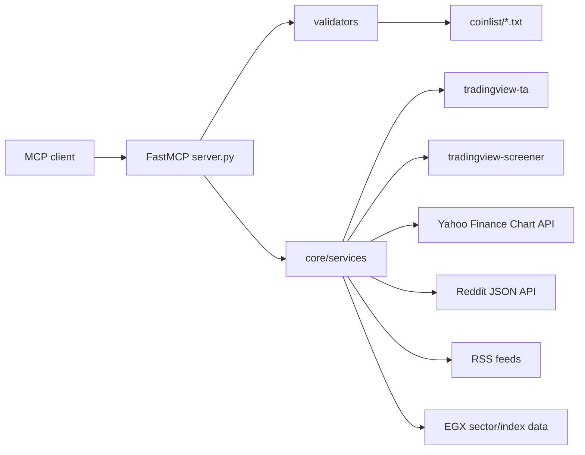

# TradingView MCP 現行仕様書

この仕様書群は、`tradingview-mcp-server` v0.7.0 の現行実装を、利用者と保守者の両方が読める形で整理したものです。根拠はローカルリポジトリ内のコード、特に `src/tradingview_mcp/server.py` と `src/tradingview_mcp/core/` 配下のサービス実装です。

外部 API のライブ値は検証対象にしていません。TradingView、Yahoo Finance、Reddit、RSS フィードの応答は時刻、ネットワーク状態、外部サービス仕様によって変わります。

## 文書構成

| 文書 | 内容 |
| --- | --- |
| [mcp-tools.md](mcp-tools.md) | MCP tool 27 件と MCP resource 1 件の利用仕様。入力、既定値、丸め、主要出力、エラー傾向を記載。 |
| [internal-design.md](internal-design.md) | ルーティング層、サービス層、データファイル、外部依存、fallback の内部設計。 |
| [operations-and-validation.md](operations-and-validation.md) | インストール、起動、transport、環境変数、コード根拠中心の検証方法。 |

## 対象読者

- MCP クライアントから TradingView MCP を使う利用者。
- tool の入力、戻り値、外部データ依存を把握したい運用者。
- `server.py` や `core/services/*` を保守・拡張する開発者。
- README より実装寄りの、ただし完全なコードリーディングより読みやすい仕様を必要とする人。

## システム概要

このパッケージは `mcp.server.fastmcp.FastMCP` を使った Python 製 MCP サーバーです。エントリポイントは `tradingview-mcp` で、既定では `stdio` transport として MCP クライアントから起動されます。任意で `streamable-http` transport も利用できます。

公開インターフェースは次の通りです。

- MCP tools: 27 件。
- MCP resource: `exchanges://list` 1 件。
- CLI: `tradingview-mcp [stdio|streamable-http] [--host HOST] [--port PORT]`。
- Python パッケージデータ: `src/tradingview_mcp/coinlist/*.txt`。

主な機能領域は、マーケットスクリーニング、個別銘柄のテクニカル分析、ローソク足・出来高パターン検出、EGX 専用分析、Reddit/RSS センチメント、Yahoo Finance 価格取得、バックテストです。

## 仕様スナップショット

| 領域 | 現行仕様 |
| --- | --- |
| MCP server | `FastMCP` インスタンスを `server.py` で生成し、tool/resource を同ファイルで登録する。 |
| 公開 tool 数 | `rating_filter` を含む 27 件。古い 26 件前提は使わない。 |
| 公開 resource | `exchanges://list`。package 内 `coinlist/*.txt` から exchange 名を返す。 |
| 主な外部データ | TradingView, Yahoo Finance Chart API, Reddit JSON API, RSS feeds。 |
| 入力検証 | timeframe/exchange は多くの tool で既定値へ fallback。厳格な validation error は基本方針ではない。 |
| 失敗表現 | `{"error": ...}`、空配列、件数 0、バッチ skip のいずれか。MCP server process を落とさない設計。 |
| 出力仕様 | 厳密 JSON Schema ではなく、現行実装で確認できる主要キー仕様。外部データ由来の詳細キーは可変。 |

## 仕様の読み方

この仕様は「現在の実装が何をしているか」を説明するものです。理想仕様や将来仕様ではありません。例えば、入力値がエラーになるのではなく既定値へ fallback する箇所、外部ライブラリがない場合に `{"error": ...}` を返す箇所、例外を握りつぶして空配列へ落とす箇所も、現行挙動として記載しています。

戻り値は厳密な JSON Schema として固定していません。理由は、外部サービスから返る指標セットやニュース項目、TradingView の `indicators` 内容が可変であり、実装も主要キーを中心に辞書を返しているためです。

各 tool の「根拠」は、MCP handler の登録位置と主な委譲先サービスを示します。戻り値の細部を変更する場合は、`server.py` だけでなく委譲先の `core/services/*` も確認してください。

## 重要な注意

- 本サーバーの出力は投資判断を補助する情報であり、金融助言ではありません。
- 外部データの正確性、完全性、リアルタイム性は保証されません。
- スクリーニングやバックテストの結果は、手数料、スリッページ、データ欠損、取引所仕様、流動性制約を完全には表現しません。
- `multi_agent_analysis` は実装上、LLM エージェントの実行ではなく、テクニカル指標から作るヒューリスティックな議論形式の出力です。
- 仕様書化に伴う公開 API や実行挙動の変更はありません。
