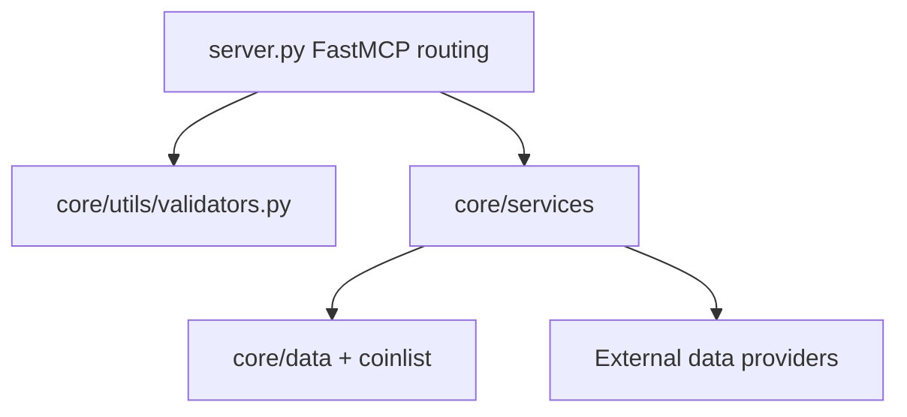

# 内部設計仕様

この文書は保守者向けに、TradingView MCP の内部構造を現行実装に沿って説明します。公開 tool の仕様は [mcp-tools.md](mcp-tools.md)、起動と検証は [operations-and-validation.md](operations-and-validation.md) を参照してください。

## 全体構造

`server.py` は routing layer です。各 `@mcp.tool()` handler は入力値の正規化、上限/下限の丸め、サービス層への委譲、戻り値整形だけを担当します。実際の計算や外部 API 呼び出しは `core/services/*` にあります。

| 層 | 主なファイル | 責務 |
| --- | --- | --- |
| MCP routing | `src/tradingview_mcp/server.py` | FastMCP の生成、tool/resource 登録、入力の軽い正規化、サービス呼び出し。 |
| Validation | `core/utils/validators.py` | timeframe/exchange の正規化、market type mapping、coinlist path 解決。 |
| Symbol data | `coinlist/*.txt` | exchange ごとの symbol universe。スキャン系 tool の探索対象。 |
| Static market data | `core/data/egx_*.py` | EGX sector/index の静的分類、通貨、構成銘柄。 |
| Services | `core/services/*.py` | 外部データ取得、指標計算、スコアリング、戻り値構築、fallback。 |
| Packaging | `pyproject.toml` | package metadata、console script、runtime dependencies、package data。 |



## Feature Data Flow

| 機能群 | 入力 | 主処理 | 出力 |
| --- | --- | --- | --- |
| Screener | exchange, timeframe, limit/filter | coinlist を読み、TradingView analysis を batch 取得して change/indicator で並べる。 | `list[dict]`。主に `symbol`, `changePercent`, `indicators`。 |
| Asset analysis | symbol, exchange, timeframe | 単一 symbol の TradingView indicators を取得し、metrics と拡張 indicator を構築する。 | `dict`。価格、indicator、market sentiment、support/resistance など。 |
| Volume/pattern | exchange/symbol, threshold 類 | TradingView indicators から candle/body/volume/RSI 条件を評価する。 | `dict` または `list[dict]`。検出件数、signal、候補銘柄。 |
| EGX | EGX symbol/sector/index, timeframe | EGX 静的分類と TradingView indicators を組み合わせ、score/setup を作る。 | `dict`。market overview、sector heatmap、trade plan など。 |
| Sentiment/news | symbol, category, limit | Reddit JSON API または RSS feed を取得し、簡易集計する。 | `dict`。sentiment score、news item、timestamp。 |
| Yahoo/backtest | Yahoo symbol, strategy, period | Yahoo Finance Chart API の quote/OHLCV を取得し、価格または戦略指標を計算する。 | `dict`。quote、snapshot、backtest metrics、folds。 |

## エントリポイント

`pyproject.toml` の console script は次の通りです。

```toml
[project.scripts]
tradingview-mcp = "tradingview_mcp.server:main"
```

`main()` は `argparse` で `transport` を受け取り、既定の `stdio` では `mcp.run()`、`streamable-http` では `mcp.run(transport="streamable-http")` を実行します。HTTP transport では `--host` と `--port`、または `HOST` と `PORT` 環境変数を使用します。

`DEBUG_MCP` が設定されている場合は、cwd、argv、実行ファイルパスを stderr に出力します。

## FastMCP Server

`mcp = FastMCP(...)` は `server.py` で生成されます。

- name: `TradingView Multi-Market Screener`
- instructions: TradingView backed multi-market screener として、crypto exchanges と stock markets をサポートする旨を説明。
- 公開 tool: 27 件。
- 公開 resource: `exchanges://list`。

`server.py` の import 時に `tradingview_screener` の import 可否を判定し、`TRADINGVIEW_SCREENER_AVAILABLE` を設定します。これは `advanced_candle_pattern()` の multi-timeframe path と fallback path の選択に使われます。

## Validation Layer

`core/utils/validators.py` は入力値の正規化と market type mapping を担当します。

- `ALLOWED_TIMEFRAMES`: `5m`, `15m`, `1h`, `4h`, `1D`, `1W`, `1M`。
- `sanitize_timeframe(tf, default)`: lowercase/trim 後に alias 変換し、未対応値は `default`。
- `EXCHANGE_SCREENER`: exchange 名から TradingView screener 名への対応表。
- `sanitize_exchange(ex, default)`: lowercase/trim 後に対応 exchange なら返し、未対応値は `default`。
- `STOCK_EXCHANGES`: stock market として扱う exchange 群。
- `is_stock_exchange(exchange)`: symbol 正規化や volume analysis で利用。
- `get_market_type(exchange)`: TradingView screener query 用の market type を返す。
- `COINLIST_DIR`: package 内 `coinlist` directory の絶対パス。

重要な挙動として、未対応入力はエラーではなく既定値に fallback します。入力ミスを厳格に検出したいクライアントは、tool 呼び出し前に独自 validation を行う必要があります。

## Symbol Lists

`core/services/coinlist.py` の `load_symbols(exchange)` は `coinlist/*.txt` を読みます。

検索順は次の方針です。

- validators が計算した package 内 coinlist path。
- exchange 名そのまま、または lowercase。
- service file から見た相対 path fallback。

読み取りに失敗した path はスキップし、最終的に symbol が見つからない場合は空配列を返します。`exchanges://list` resource は `coinlist` directory の `.txt` ファイル名から exchange 名を生成し、directory を読めない場合は common exchanges の固定文字列へ fallback します。

## Service Modules

### `screener_service.py`

TradingView ベースのスクリーニングと単一銘柄分析を担当します。

- `fetch_bollinger_analysis()`: symbol list を取得し、TradingView analysis から BBW や rating を計算して squeeze 候補を返す。
- `fetch_trending_analysis()`: 複数 symbol を batch 取得し、`changePercent` を中心に ranking を作る。
- `fetch_multi_changes()`: 複数 timeframe の open/close を取得して変化率を計算する。
- `fetch_multi_timeframe_patterns()`: tradingview-screener を使う multi-timeframe candle pattern path。
- `scan_advanced_candle_patterns_single_tf()`: multi-timeframe path が使えない場合の fallback。
- `analyze_coin()`: 単一 symbol の price、indicator、market sentiment、support/resistance などを集約する。
- `scan_consecutive_candles()`: 連続 candle pattern を検出する。
- `run_multi_timeframe_analysis()`: Weekly から 15m までの整合性を評価する。

`tradingview_ta` が import できない場合、該当機能は `{"error": "tradingview_ta is missing; run `uv sync`."}` を返す実装です。

### `screener_provider.py`

`tradingview-screener` を使う低レベル provider です。timeframe を TradingView resolution code に変換し、indicator column を取得します。例外時は `error` を含む辞書を返すか、multi-timeframe 取得では base timeframe のみへ fallback する設計が含まれています。

### `scanner_service.py`

出来高系 scanner を担当します。

- `volume_breakout_scan()`: current volume と `volume.SMA20` を比較し、volume ratio と price change の条件を満たす銘柄を返す。
- `volume_confirmation_analyze()`: 単一銘柄の出来高、価格変化、Bollinger position、RSI から signal を作る。
- `smart_volume_scan()`: volume breakout の結果を RSI range で絞り込み、`trading_recommendation` を付与する。

`volume.SMA20` がない場合、現在 volume の半分を平均推定として volume ratio を計算する fallback があります。

### `egx_service.py`

Egyptian Exchange 専用機能を担当します。`core/data/egx_sectors.py` と `core/data/egx_indices.py` の静的データを利用します。

- market overview: 上昇、下落、出来高、market stats。
- sector scan: sector ごとの銘柄分析、空 sector で一覧表示。
- sector scanner: sector heatmap、top picks、rotation signals。
- index analysis: EGX index 構成銘柄、sector breakdown、gainers/losers。
- stock screener: composite stock score、grade、qualified trades、watchlist。
- trade plan: score、setup、entry、stop、targets、quality、recommendation。
- Fibonacci: swing high/low、retracement/extension、position、interpretation。

EGX 関連 tool は stock score や trade setup を生成しますが、戻り値には教育目的・金融助言ではない旨の disclaimer が含まれるものがあります。

### `indicators.py` と `indicators_calc.py`

`indicators.py` は TradingView indicators を解釈して、複合スコアや trade setup を作ります。

- `compute_metrics()`: 価格、Bollinger、RSI など基本 metric。
- `extract_extended_indicators()`: TradingView 指標辞書を詳細カテゴリへ展開。
- `analyze_timeframe_context()`: timeframe に応じた分析文脈。
- `compute_stock_score()`: 100 点満点の複合 score。
- `compute_trade_setup()`: entry、stop、targets、support/resistance。
- `compute_trade_quality()`: trade setup quality。
- Fibonacci 系 helper。

`indicators_calc.py` はバックテスト用に OHLCV から indicator を計算します。EMA、SMA、RSI、Bollinger、MACD、ATR、Supertrend、Donchian を提供します。

### `multi_agent_service.py`

`multi_agent_analysis` の出力を生成します。名称は multi-agent ですが、実装上は外部 LLM agent を呼びません。

- Technical analyst: TradingView indicators と metrics を使う。
- Sentiment analyst: price momentum、MACD、RSI から sentiment score を作る。
- Risk manager: Bollinger width と moving average structure から risk score を作る。
- Consensus: 各観点を合わせて recommendation を作る。

### `sentiment_service.py`

Reddit JSON API から投稿を取得し、単語ベースのスコアリングで sentiment を作ります。

- subreddit group は `crypto`, `stocks`, `all` の意図で構成。
- 取得は `urllib` opener を使用し、proxy 設定があれば proxy 経由。
- 投稿取得失敗時は空配列を返し、集計結果は posts 0 件として成立します。
- `sentiment_score`, `sentiment_label`, 件数、top posts、sources、timestamp を返します。

### `news_service.py`

RSS フィードから金融ニュースを取得します。

- `feedparser` が利用可能な場合に RSS を parse。
- category は `crypto`, `stocks`, `all` の意図。
- symbol 指定時は title/summary 内の一致で絞り込み。
- 戻り値には `feedparser_available` が含まれます。

### `yahoo_finance_service.py`

Yahoo Finance Chart API から price quote と market snapshot を取得します。

- `_fetch_quote(symbol)`: `https://query1.finance.yahoo.com/v8/finance/chart/{symbol}?interval=1d&range=2d`。
- `get_price(symbol)`: price、previous close、change、currency、exchange、market state、52 week high/low。
- `get_market_snapshot()`: `indices`, `crypto`, `fx`, `etfs` の固定 symbol group を順に取得。

個別 quote 取得に失敗した場合、`get_price()` は `{"symbol": ..., "error": ..., "source": "Yahoo Finance"}` を返します。`get_market_snapshot()` は error のない quote だけをカテゴリ配列に入れます。

### `backtest_service.py`

Yahoo Finance の historical OHLCV を使ってバックテストします。

- `_fetch_ohlcv()`: Yahoo Finance Chart API から candle を取得。直接接続に失敗した場合、proxy opener 経由を試します。
- strategy: `rsi`, `bollinger`, `macd`, `ema_cross`, `supertrend`, `donchian`。
- valid periods: `1mo`, `3mo`, `6mo`, `1y`, `2y`。
- valid intervals: `1d`, `1h`。
- metrics: total trades、win rate、return、final capital、drawdown、profit factor、Sharpe、Calmar、expectancy など。
- walk-forward: fold ごとに train/test を分け、robustness score と verdict を返します。

### `proxy_manager.py`

Yahoo Finance や Reddit の HTTP 取得で使う optional proxy support です。認証情報は環境変数だけから読みます。

- `PROXY_ENABLED`: 既定 `true`。
- `PROXY_HOST`: 既定 `p.webshare.io`。
- `PROXY_PORT`: 既定 `80`。
- `PROXY_USERNAME_PREFIX`: 必須。未設定なら proxy 無効扱い。
- `PROXY_PASSWORD`: 必須。未設定なら proxy 無効扱い。
- `PROXY_SESSION_MIN`, `PROXY_SESSION_MAX`: sticky session ID の乱数範囲。

`python-dotenv` が import できる場合はリポジトリ直下 `.env` を読みます。ただし `pyproject.toml` の runtime dependencies には `python-dotenv` は含まれていないため、基本は環境変数で運用します。

## 外部依存

`pyproject.toml` の runtime dependencies は次の通りです。

- `mcp[cli]>=1.12.0`
- `tradingview-ta>=3.3.0`
- `tradingview-screener>=0.6.4`
- `feedparser>=6.0.12`

加えて、標準ライブラリの `urllib.request` で Yahoo Finance、Reddit、RSS endpoint へアクセスします。外部サービスの仕様変更、rate limit、ネットワーク断、対象 symbol の上場廃止や名称変更は、戻り値の欠損、空配列、`error` 辞書として現れます。

## Error And Fallback Policy

現行実装の基本方針は「MCP server 自体を落とさず、tool の戻り値で失敗を表現する」です。

- 入力不正: 多くの tool では validation error ではなく既定値へ fallback。
- 外部 library 不足: `{"error": "... is missing; run `uv sync`."}`。
- 外部 API 例外: error 辞書、空配列、またはバッチ単位の skip。
- symbol list 不足: error 辞書、または空配列。
- multi-timeframe candle pattern: `tradingview-screener` が使えない、または失敗した場合は single-timeframe fallback。
- proxy: 未設定なら通常 opener を使い、設定済みなら proxy opener を使う。

この設計により、クライアント側は HTTP/MCP transport の失敗と tool-level の `error` を分けて扱う必要があります。

## 拡張時の実装ルール

新しい tool を追加する場合は、現行構造に合わせて次の順序にします。

1. `server.py` では入力正規化、範囲丸め、サービス呼び出しだけを行う。
2. 計算や外部 API 呼び出しは `core/services/*` に置く。
3. exchange/timeframe は既存 validators を使う。
4. symbol list が必要な場合は `coinlist` と `load_symbols()` を使う。
5. 失敗は原則として `{"error": ...}` を返し、サーバープロセスを落とさない。
6. 公開 tool を増減した場合は [mcp-tools.md](mcp-tools.md) と AST 件数検証を更新する。
